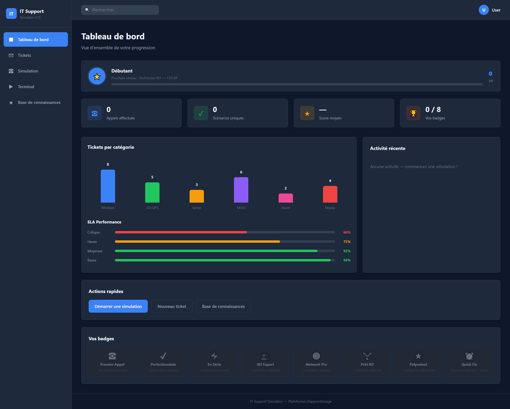
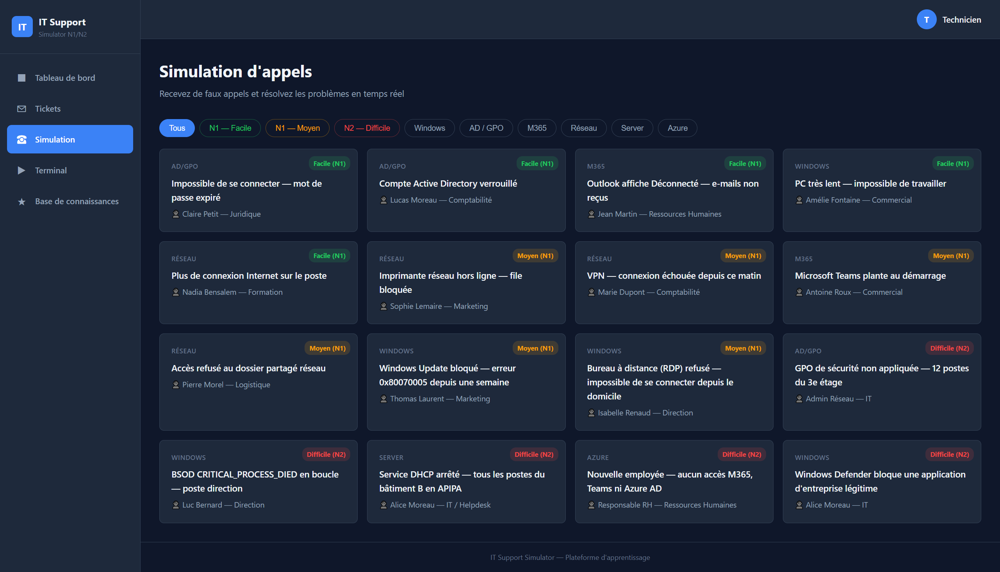
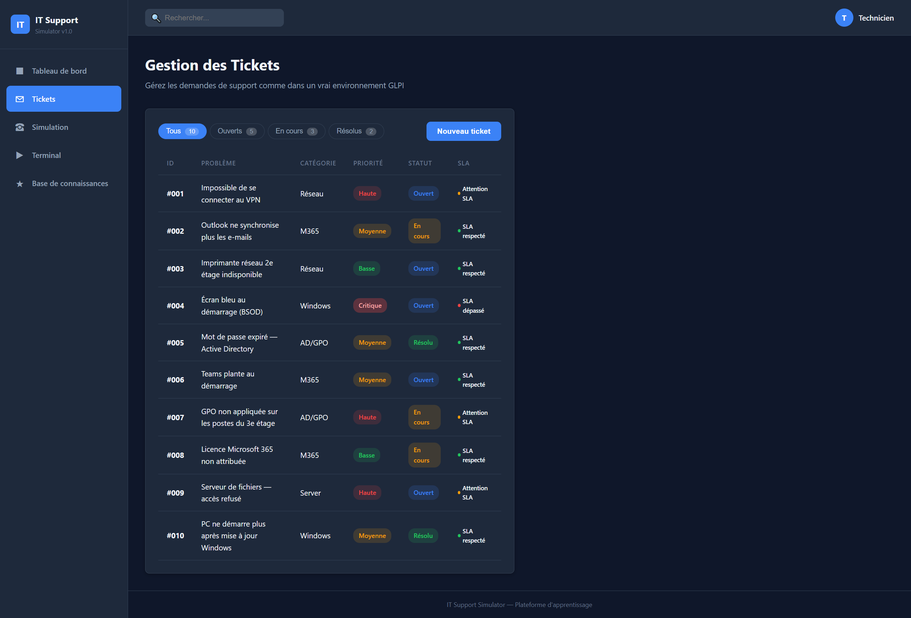
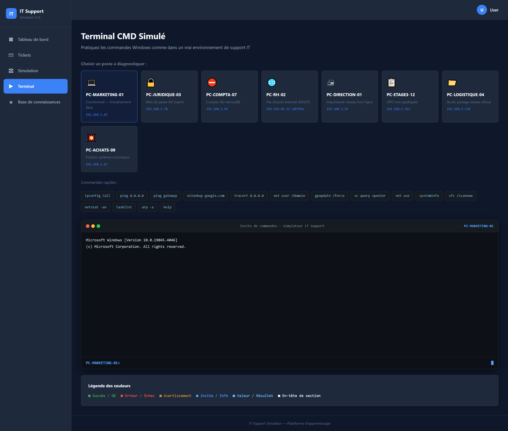
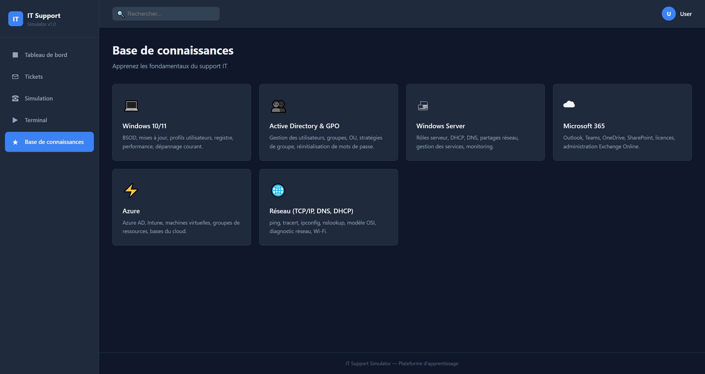

# IT Support Simulator

An interactive learning platform for **Level 1 & 2 IT support technicians**.  
Simulate support calls, manage GLPI tickets, and practice CMD commands — no installation required.

> **Status:** Work in progress — currently tested locally only. Bugs may be present.  
> **Language:** The simulator interface is entirely in French, designed for French-speaking IT support learners.

---

## Screenshots

### Dashboard


### Call Simulator


### GLPI Tickets


### CMD Terminal


### Knowledge Base


---

## Overview

| Module | Description |
|--------|-------------|
| **Call Simulation** | Receive realistic IT support calls and resolve incidents step by step (guided MCQ) |
| **CMD Terminal** | Practice 25+ Windows commands on 8 pre-configured machines with real failure scenarios |
| **GLPI Tickets** | Manage 80 realistic support tickets (open → in progress → resolved → closed) |
| **XP Progression** | Earn XP, level up, and unlock achievement badges |
| **Knowledge Base** | Quick reference by domain (Windows, AD, M365, Azure, Network, Server) |

---

## Quick Start

No installation. No server. No dependencies.

```
1. Clone or download the repository
2. Open index.html in your browser
```

Works directly from `file://`.

---

## Features

### Call Simulator (13 scenarios)

- **5 Easy N1 scenarios** — expired password, locked account, Outlook disconnected, slow PC, APIPA
- **4 Medium N1 scenarios** — offline printer, VPN failure, Teams crash, shared folder access denied
- **4 Hard N2 scenarios** — GPO not applied, BSOD, DHCP service down, Azure M365 license issue

Each scenario includes:
- A realistic caller context (name, department, mood)
- Diagnostic steps as MCQ (4 options with pedagogical feedback)
- An integrated terminal to test related commands
- A hint system (no score penalty)

### Simulated CMD Terminal

25+ commands with context-aware behavior:

```
ipconfig /all    ping    tracert    nslookup
net user         net use    gpupdate /force
sc query         tasklist    netstat    sfc /scannow
dism    chkdsk    systeminfo    nltest    dsquery
```

8 pre-configured machines each with a specific failure (APIPA, locked account, broken GPO, corrupted files, etc.)

### Progression System

| Level | Name | XP Required |
|-------|------|-------------|
| 1 | Beginner | 0 XP |
| 2 | N1 Technician | 150 XP |
| 3 | N1 Specialist | 400 XP |
| 4 | N2 Technician | 800 XP |
| 5 | N2 Expert | 1,500 XP |
| 6 | N2 Confirmé | 2,500 XP |

**8 badges** to unlock: First Call, Perfectionist, On a Streak, AD Expert, Network Pro, N2 Ready, Versatile, Quick Fix.

---

## Tech Stack

| Item | Detail |
|------|--------|
| Language | HTML5 + CSS3 + Vanilla JavaScript (ES6+) |
| Dependencies | **None** — no npm, no CDN, no framework |
| Persistence | `localStorage` only |
| Compatibility | Works on `file://` and any HTTP server |
| Responsive | Yes — mobile sidebar with hamburger menu |

---

## Project Structure

```
/
├── index.html          — Landing page
├── dashboard.html      — XP / badges / stats dashboard
├── simulation.html     — N1/N2 call simulator
├── terminal.html       — Standalone CMD terminal
├── tickets.html        — GLPI ticket management
├── knowledge.html      — Knowledge base
├── css/style.css       — Dark theme design system (CSS variables)
├── js/
│   ├── app.js          — Core: translations, navigation
│   ├── terminal.js     — CMD engine (IIFE)
│   ├── scenarios.js    — 13-scenario database
│   └── progress.js     — XP, levels, badges
└── STRUCTURE.md        — Full technical documentation (French)
```

For detailed technical documentation, see [STRUCTURE.md](STRUCTURE.md).

---

## Roadmap

- [ ] Real content in the knowledge base (articles per category)
- [ ] Expand to 30+ scenarios
- [ ] Exam mode — no hints, timed
- [ ] Toast notifications / SLA alerts
- [ ] Multi-profile login
- [ ] Settings page (reset, preferences)

---

## Fictional Environment

All scenarios share a consistent environment:

| Element | Value |
|---------|-------|
| AD Domain | `CORP.LOCAL` |
| Subnet | `192.168.1.0/24` |
| Domain Controller | `DC01.CORP.LOCAL` |
| Machine format | `PC-[DEPT]-[NUM]` |
| Account format | `firstname.lastname` |
