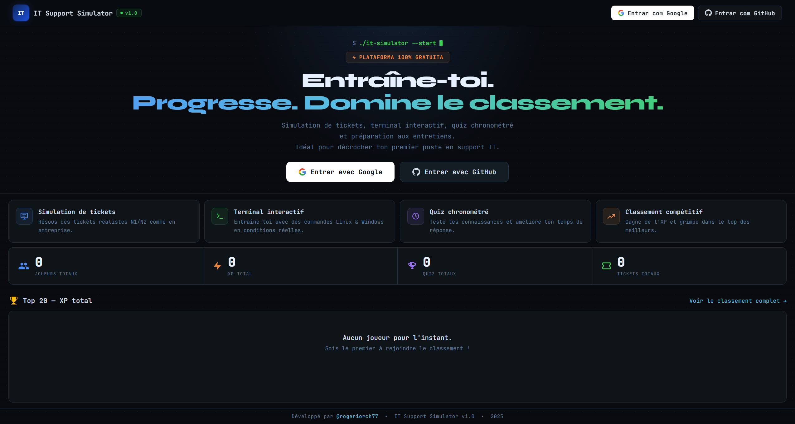

# IT Support Simulator N1/N2

> A hands-on simulation platform for IT support technicians (N1/N2) — practice tickets, terminal, timed quiz and interview prep. Built to help land your first IT job.

**Live →** [rogeriorch77.github.io/it-support-simulator](https://rogeriorch77.github.io/it-support-simulator)  
**Stack →** Vanilla HTML/CSS/JS · Supabase Auth · GitHub OAuth · Zero dependencies  
**Language →** Interface entirely in French 🇫🇷 — designed for French-speaking IT learners

---

## Screenshots

### Landing Page


### Dashboard


### Call Simulator


### Ticket Management


### Interactive Terminal


### Knowledge Base


### Timed Technical Quiz


### Interview Preparation


---

## Modules

| Module | Description |
|--------|-------------|
| **Public Leaderboard** | Real-time XP ranking visible without login — global competition |
| **Call Simulator** | 13 N1/N2 realistic scenarios with caller context, MCQ diagnostic steps and pedagogical feedback |
| **CMD Terminal** | 25+ Windows commands across 8 pre-configured machines with specific failure scenarios |
| **GLPI Tickets** | 80 realistic support tickets — open → in progress → resolved, with terminal resolution |
| **Knowledge Base** | Quick reference by domain (Windows, AD, M365, Azure, Network, Server) |
| **Technical Quiz** | 30 timed N1/N2 questions, single and multiple choice, speed bonus, XP synced to leaderboard |
| **Interview Prep** | 45 N1/N2 interview Q&As with STAR method and category filters |

---

## XP & Level System

| Level | Name | XP Required |
|-------|------|-------------|
| 1 | Débutant | 0 XP |
| 2 | Technicien | 500 XP |
| 3 | Support N1 | 1,500 XP |
| 4 | Support N2 | 3,500 XP |
| 5 | Spécialiste | 7,000 XP |
| 6 | Expert | 14,000 XP |
| 7 | Architecte | 25,000 XP |
| 8 | Elite | 50,000 XP |

XP earned in quizzes, synced to Supabase. Public leaderboard, no cap.

---

## Authentication

Login via **GitHub OAuth** — no password, no sensitive data stored.  
The leaderboard is publicly visible. Login unlocks personal progression tracking.

---

## Tech Stack

| Item | Detail |
|------|--------|
| Frontend | HTML5 + CSS3 + Vanilla JavaScript ES6+ |
| Auth | Supabase Auth — GitHub OAuth |
| Database | Supabase (PostgreSQL) — profiles and XP only |
| Hosting | GitHub Pages |
| Dependencies | Supabase JS SDK via CDN — zero npm, zero framework |
| Compatibility | All modern browsers |

---

## Project Structure

```
/
├── index.html            — Landing page + public leaderboard
├── dashboard.html        — XP / levels / statistics
├── simulation.html       — N1/N2 call simulator
├── terminal.html         — Interactive CMD terminal
├── tickets.html          — GLPI ticket management
├── knowledge.html        — Knowledge base
├── entretiens.html       — Interview preparation
├── quiz.html             — Timed technical quiz
├── schema.sql            — Supabase database schema
├── img/                  — Screenshots and assets
├── css/style.css         — Dark theme design system
└── js/
    ├── app.js            — Core: translations, navigation
    ├── auth.js           — Supabase Auth + guard + XP sync
    ├── config.example.js — Config template (copy → config.js)
    ├── terminal.js       — CMD engine
    ├── scenarios.js      — 13-scenario database
    ├── tickets.js        — 80-ticket database
    └── progress.js       — XP, levels, badges
```

---

## Fictional Environment

| Element | Value |
|---------|-------|
| AD Domain | `CORP.LOCAL` |
| Subnet | `192.168.1.0/24` |
| Domain Controller | `DC01.CORP.LOCAL` |
| Machine format | `PC-[DEPT]-[NUM]` |
| Account format | `firstname.lastname` |

---

Built by [@rogeriorch77](https://github.com/rogeriorch77)
